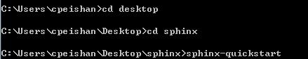

===================
Sphinx快速入门
===================

安装Sphinx
===================

Windows系统

date: 2018/04/24

author: 陈佩珊

-------------------

1.安装pip. 
  打开cmd，运行以下代码：pip install Sphinx
2.创建源文档.
  桌面新建一个文件夹并命名Sphinx,在cmd中依次输入cd desktop, cd sphinx,
  运行代码：sphinx-quickstart

然后根据cmd中提示内容输入：
  

3.新建项目.
  打开步骤二中的文件夹sphinx, 选择source文件夹，再次新建文件夹，自行命名（例：setup）,然后创建.rst文件
   

选择index.rst文件，将新建的.rst文件路径写入：
	

4.打开cmd,运行代码：sphinx-build -b html source build
  打开build文件夹，点击index.html查看网页内容

   